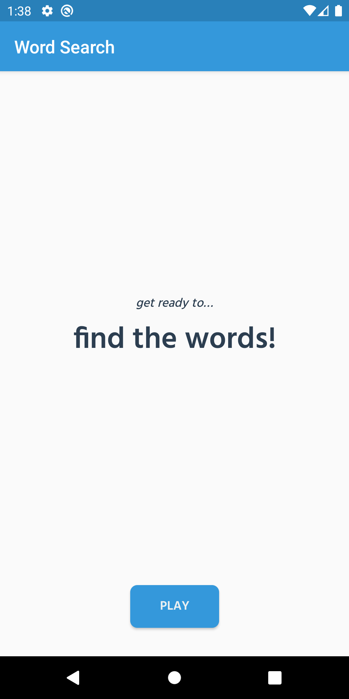
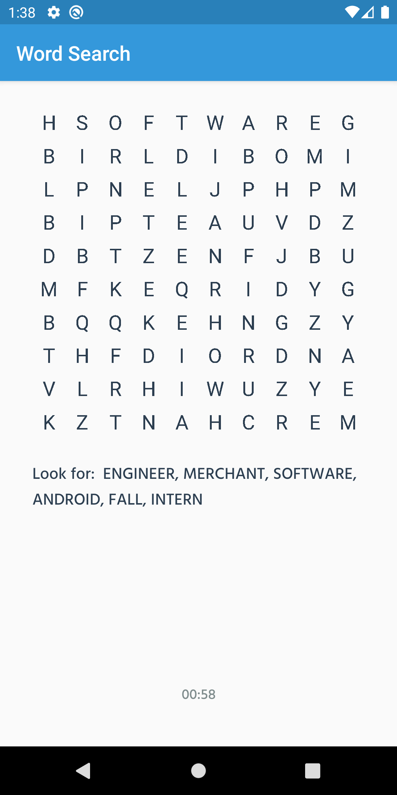
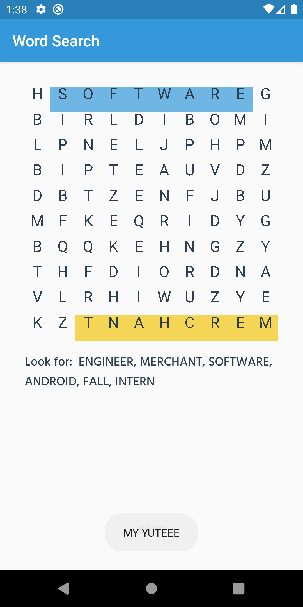
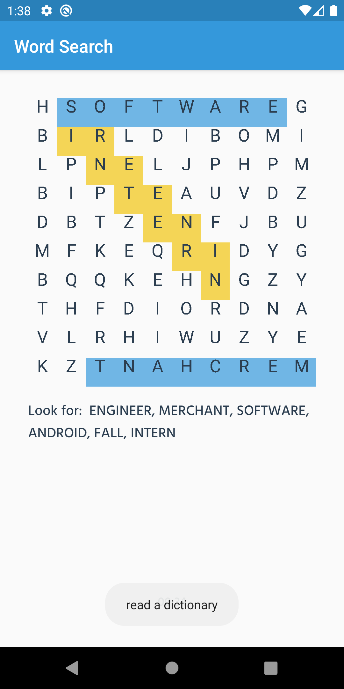
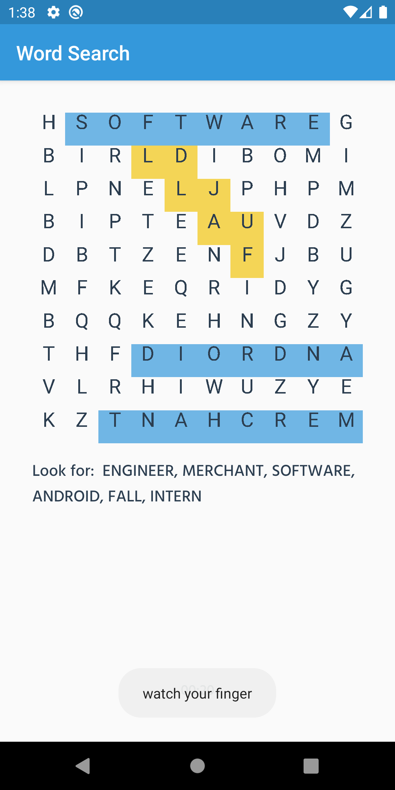
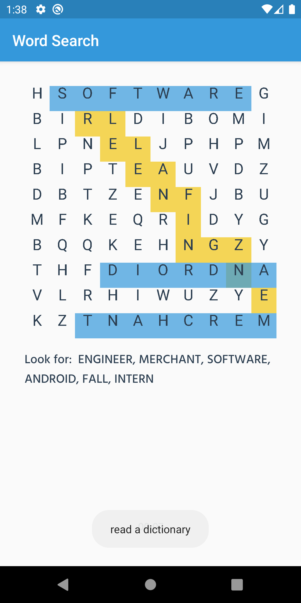
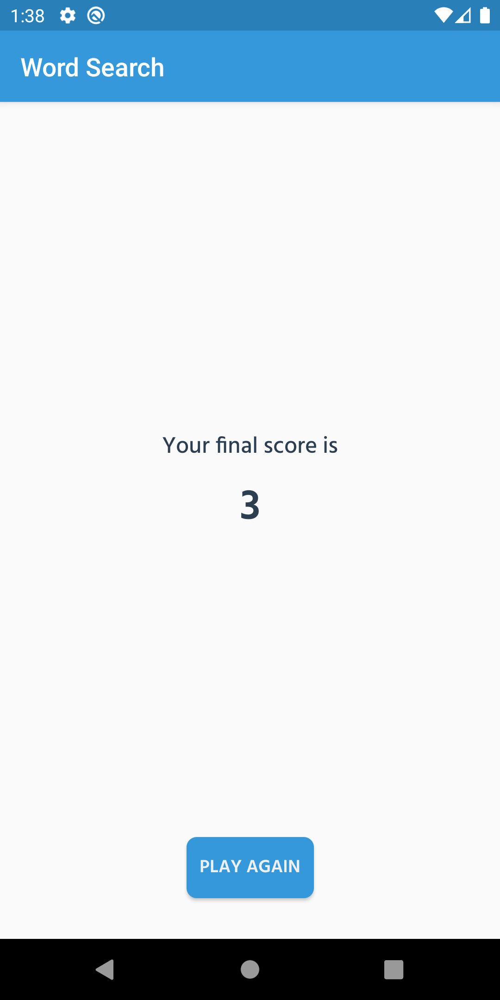

# Word Search 🔍

Hey! Hope that all is going well 🤠 This is my submission for the Mobile Development Shopify Coding Challenge 🚀

## Requirements 📃
- [X] Create a word search mobile app for Android
- [X] The word search should have at least a 10x10 grid
- [X] Include at least the following 6 words: Swift, Kotlin, ObjectiveC, Variable, Java, Mobile
- [X] Keep track of how many words a user has found
- [X] Make sure it compiles successfully
- [X] Randomize where the words are placed
- [X] Make a slick UI with smooth animations
- [ ] Make it look good in portrait and landscape
- [X] Feel free to add any additional features you can think of
- [X] Allow the user to find the words by swiping over the words

## Project Structure 🗃️
The project is split into the following components:
- `/custom`
  - contains `GridView` class
  - custom view built to display the puzzle and handle user input
- `/game`
  - contains `GameFragment` and `GameViewModel`
  - gives the view the puzzle to be displayed, keeps track of score and ends the game
- `/main`
  - contains `MainActivity` and `MainApplication`
  - overwrote default `Application` to implement `Timber` logging globaly
- `/score`
  - contains `ScoreFragment`, `ScoreViewModel` and `ScoreViewModelFactory`
  - shows you your final score and asks whether you would like to play again
- `/title`
  - contains `TitleFragment`
  - loading screen for the app
- `/wordPlacement`
  - contains `WordSearch` class, `PlacementType` enum class and `Word` data class
  - deals with the logic to create the word search puzzle

For more information, take a look at the `README.md` file in each directory! 

## The Puzzle 🧩
Each puzzle consists of 6 words picked at random from the list below. Words are placed at random locations. Words are only placed if all the tiles needed are either empty, or the characters match.

Placement types are also chosen at random. Words can be placed from the left to the right, from the right to the left, up, down, diagonally and diagonally backwards.

```
"Kotlin", "Swift", "Java", "ObjectiveC", "Variable", "Mobile", "Shopify", "Fall", "Challenge", "Android", "Engineer", "Intern", "Store", "Culture", "Merchant", "Build", "Business", "Journey", "Market", "Explore", "Invest", "Software", "Powered", "Commerce", "Retail" 
```

## Screenshots 📱
### Title Screen
<p align="left">
  
</p>


Does not contain too much, just some text and a button to get the game started.

### Game Screen
<p align="left">
  
</p>

The first screenshot in this section is what you see when the game first starts. It contains the puzzle, list of the words used to construct it, and a minute long timer ticking down.

<p align="left">
  
</p>

In the second screenshot, you can see what happens when you select a word correctly and what happens when you're still selecting characters. While still selecting characters, their tiles turn yellow until the user's finger is lifted. If the string selected is one of the words used, then the tiles turn blue and a Toast is returned. Otherwise, the tiles turn back to white and a different Toast appears.

<p align="left">
  
</p>
<p align="left">
  
</p>

In the third and fourth screenshots, you can see two words being placed diagonally. `INTERN` is going from the top left to the bottom right, while `FALL` is going from the bottom right to the top left (backwards diagonal). Diagonal selection is a bit sensative and as such unwanted tiles are also selected when using the emulator.

<p align="left">
  
</p>

The fifth screenshot in this section shows characters being reused. `ANDROID` (going from the right to the left) and `ENGINEER` (going from the bottom right to the top left) have an `N` in common. 

### Score Screen
<p align="left">
  
</p>

Contains the game score (number of words found) and a button to play again.